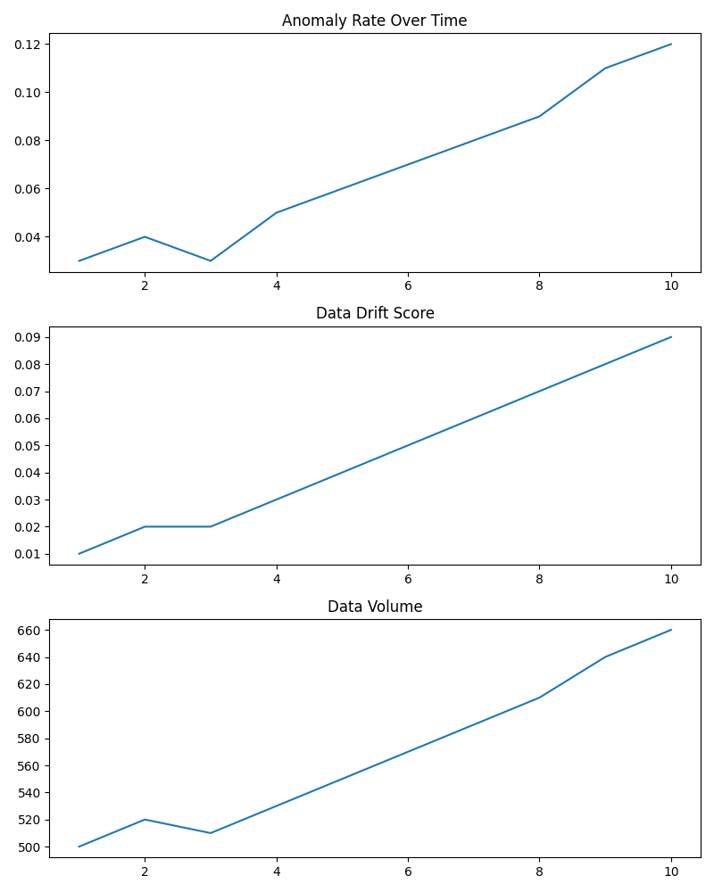

# ML Model Monitoring

This project demonstrates how machine learning models can be monitored in production environments.

The repository illustrates common monitoring strategies used by ML platform teams, including:

• data drift detection  
• model performance monitoring  
• alerting strategies  
• investigation workflows  

The example implementation uses statistical drift detection to compare training data with production data.

## Project Context

This repository demonstrates how machine learning models can be monitored once deployed in production environments.

It complements the anomaly detection model developed in the `network-attack-detection` repository and the deployment architecture defined in the `ml-anomaly-detection-system-launch` project.

Together these repositories illustrate the full machine learning lifecycle:

Model Development → Deployment Architecture → Production Monitoring

## System Architecture

The monitoring workflow simulates how machine learning models are monitored in production environments.

Model predictions
        ↓
Prediction logging
        ↓
Metric calculation (accuracy, drift indicators)
        ↓
Distribution monitoring
        ↓
Drift detection alerts
        ↓
Model retraining trigger

## Why ML Monitoring Matters

Machine learning models often degrade in production due to:

• changes in incoming data distributions  
• evolving user behavior  
• upstream pipeline changes  
• model concept drift

Without monitoring, models can silently fail while still producing predictions.

This project demonstrates how production ML systems detect and respond to these issues.

## Monitoring Signals

The system tracks three categories of signals:

### Data Quality
• missing values
• feature distribution changes

### Data Drift
• statistical divergence between training and production data

### Model Performance
• anomaly rate trends
• prediction confidence

## Sample Code

```python
from scipy.stats import ks_2samp

def detect_feature_drift(train_feature, prod_feature):
    stat, p_value = ks_2samp(train_feature, prod_feature)
    return p_value
```markdown

The Kolmogorov–Smirnov test compares two distributions and detects statistically significant drift.

## Monitoring Architecture

training data
      ↓
production data
      ↓
drift detection
      ↓
alerting system
      ↓
investigation
      ↓
model retraining

## Alerting Strategy

Alerts are triggered when:

• p-value < 0.05 for any monitored feature  
• anomaly rate changes by more than 5%  
• prediction latency exceeds threshold

These alerts signal that the model may require retraining or investigation.

## Investigation Workflow

When monitoring alerts trigger:

1. Confirm the alert is not caused by upstream pipeline changes.
2. Compare feature distributions against training data.
3. Evaluate model performance on labeled validation samples.
4. Decide whether retraining is required.

## Monitoring Dashboard

Example monitoring signals tracked in production.



## Limitations

This repository demonstrates monitoring concepts using a simplified dataset.

Real systems would require:

• larger production datasets
• automated monitoring pipelines
• integrated alerting infrastructure

## Monitoring Configuration

Monitoring thresholds and rules are defined in `config/monitoring_config.yaml`.

Example configuration:

- drift detection using Kolmogorov–Smirnov statistical test
- drift threshold set to p-value < 0.05
- monitoring key network traffic features

